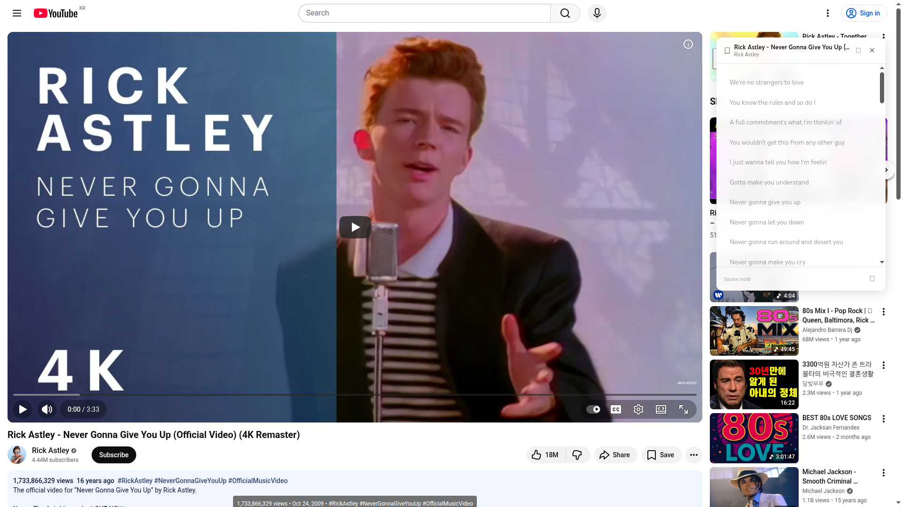
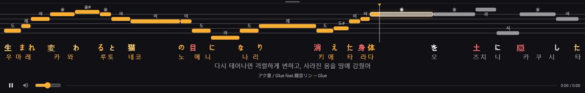

# Everyric2

유튜브 영상에 **타임싱크 가사·번역·발음·가라오케 음정 바**를 얹어 주는 로컬 서버 + Chrome 확장.

가사 텍스트만 있으면 CTC 강제 정렬(GPU 가속)로 줄·글자 단위 타이밍을 만들고, LLM으로 자연스러운 가사체 번역과 한글 독음을 붙이고, 보컬 멜로디(f0)를 전사해 노래방 스타일 음정 바까지 그려 줍니다.



*가라오케 모드(PiP) — 멜로디 노트·계이름·한글 독음·가사체 번역:*



```
┌────────────────┐   가사 검색/생성/번역     ┌───────────────────────────┐
│ Chrome 확장     │ ◄───────────────────► │ Everyric2 서버 (FastAPI)   │
│ (유튜브 오버레이) │                       │ CTC 정렬 · demucs · RMVPE  │
└────────────────┘                       │ LLM 번역/독음 · yt-dlp     │
                                         └───────────────────────────┘
```

## 주요 기능

### Chrome 확장 (`everyric2-chrome/`)
- **가사 오버레이**: 유튜브 위 드래그 가능한 패널, 현재 줄 하이라이트 + 글자 단위 카라오케 필
- **자동 가사 검색**: 서버 저장 싱크 → 보카로 가사 위키(발음·사람 번역) → LRCLIB 순
- **AI 싱크 생성**: 가사 붙여넣기 → 서버가 오디오를 받아 정렬 (진행 단계·퍼센트 칩 표시, 칩 클릭으로 언제든 취소)
- **전사 완료 브라우저 알림**: 백그라운드에서 돌던 싱크 생성이 끝나면 브라우저 알림으로 알려줌
- **번역·한글 독음**: LLM이 곡 전체 맥락으로 가사체 번역 + 원문 발음의 한글 표기
- **가라오케 음정 바 (BETA)**: PiP 창에 멜로디 노트·계이름·발음·마이크 음정 궤적, 멜로디 신디사이즈·메트로놈(배속/시작 박) 재생, 곡 키·BPM 표시, 좌상단 미니 토글로 가라오케/영상 전환
- **유튜브 자막 가져오기**: 영상 자막(예: 일본어 가사 자막)을 타이밍 그대로 싱크 가사로
- **싱크 링크**: inst·커버 영상이 원본 영상의 전사를 오프셋 + 배속(rate, nightcore 커버 등)과 함께 재사용
- **영상별 싱크 오프셋**: ±0.1s 조정이 영상마다 서버에 저장·복원

### 서버 (`everyric2/`)
- **CTC 강제 정렬**: HuggingFace MMS wav2vec2, RTX GPU에서 4분 곡 기준 수십 초
- **독음(ko) 정렬**: 한글 발음 텍스트로 정렬 후 원문에 역매핑 — 일본어 합성음(보컬로이드)에서 신뢰도 대폭 개선
- **타이밍 보정 체인**: demucs 보컬 분리 → VAD 기반 라인 클램프·늘임음 연장·간주 스냅
- **멜로디 전사**: RMVPE(폴백 FCPE) f0 → 음절 앵커 노트, 옥타브 폴딩, 키 추정(K-S) + 스케일 스냅
- **번역 엔진**: Gemini / NVIDIA NIM / OpenAI 호환(로컬 LLM) — 키가 없으면 자동 전환, 독음 가나 혼입 자동 검증·재시도

### After Effects 패널 (`everyric2-ae/`)
- **Everyric Studio**: 정렬 결과를 편집 가능한 AE 텍스트 레이어 타이포그래피로 변환 — 패널에서 직접 로컬 정렬 실행, 엔진 원클릭 설치, 업데이트 확인

## 다운로드

빌드된 배포본은 [Releases](https://github.com/onpe5679/Everyric2/releases)에서 받을 수 있습니다:

| 구성 요소 | 파일 | 설치 |
|---|---|---|
| Chrome 확장 | `Everyric-Chrome-<버전>.zip` | 압축 해제 → `chrome://extensions` → 개발자 모드 → **압축해제된 확장 프로그램 로드** |
| 서버/엔진 | `everyric2-<버전>-py3-none-any.whl` | `pip install <경로/URL>` (소스 설치는 아래 빠른 시작 참고) |
| After Effects 패널 | `Everyric-Studio-<버전>.zxp` | [aescripts ZXP Installer](https://aescripts.com/learn/zxp-installer/)로 열기 (AE 2024+) |

## 빠른 시작

### 1. 서버

요구 사항: Python 3.10+, ffmpeg, (권장) CUDA GPU

```bash
git clone https://github.com/onpe5679/Everyric2.git
cd Everyric2
pip install uv && uv sync            # 또는 pip install -e ".[all]"

# GPU (RTX 50xx는 cu128 필수)
uv pip install "torch==2.8.0+cu128" --index-url https://download.pytorch.org/whl/cu128

# 멜로디 전사용 RMVPE 가중치 (선택 — 없으면 FCPE 자동 폴백)
# hf_hub_download("lj1995/VoiceConversionWebUI", "rmvpe.pt") → models/rmvpe/rmvpe.pt

uv run uvicorn everyric2.server.main:app --port 8000   # 기본 127.0.0.1(로컬 전용)
```

번역·독음을 쓰려면 API 키 하나를 설정합니다 (없으면 무료 웹 번역 폴백 — 발음표기 불가):

```bash
# 둘 중 하나
export GEMINI_API_KEY=...
export NVIDIA_API_KEY=nvapi-...   # 또는 저장소 루트에 nvapi.txt (gitignore됨)
```

> **⚠️ 보안 경고 — 외부에 노출하기 전에 반드시 읽으세요**
>
> 서버 기본 bind는 `127.0.0.1`(로컬 전용, 인증 없음)입니다. `--host 0.0.0.0` 등으로
> LAN·공인망에 노출한다면 **`EVERYRIC_SERVER_API_KEY`를 반드시 설정하세요.** CORS
> 설정(`chrome-extension://` 오리진만 허용)은 브라우저가 보내는 요청만 막을 뿐,
> `curl`이나 스크립트로 직접 호출하는 요청은 Origin 헤더 자체가 없어 CORS와 무관하게
> 통과합니다 — 즉 CORS는 노출된 서버를 지켜주지 않습니다.
>
> 공개 배포에는 추가로 `EVERYRIC_SERVER_ADMIN_API_KEY`와
> `EVERYRIC_SERVER_DAILY_DESTRUCTIVE_LIMIT`(기본 2)를 함께 설정하는 것을 권장합니다 —
> 강제 재생성·싱크 초기화 같은 파괴적 행위를 영상당 하루 한도로 제한하고, 어드민 키
> 보유자만 무제한으로 둘 수 있습니다.

### 2. Chrome 확장

[Releases](https://github.com/onpe5679/Everyric2/releases)의 `Everyric-Chrome-<버전>.zip`을 받아 압축 해제하거나, 소스에서 빌드합니다:

```bash
cd everyric2-chrome
npm install && npm run build
```

`chrome://extensions` → 개발자 모드 → **압축해제된 확장 프로그램 로드** → 압축 해제한 폴더(또는 `everyric2-chrome/dist`) 선택.
유튜브에서 음악 영상을 열면 자동으로 패널이 뜹니다 (툴바 아이콘으로 수동 토글).

> Windows에서 서버 URL은 `http://127.0.0.1:8000`을 쓰세요 — `localhost`는 IPv6 선시도로 요청당 ~2초 지연될 수 있습니다 (확장 기본값이 이미 127.0.0.1).

## 서버 API 요약

| 메서드 | 경로 | 설명 |
|---|---|---|
| GET | `/health` | 상태·GPU 확인 |
| GET | `/api/sync/{video_id}` | 저장된 싱크 조회 (템포·키·사용자 오프셋 포함) |
| POST | `/api/sync/generate` | 싱크 생성 잡 등록 (같은 영상·가사 진행 중이면 합류) |
| POST | `/api/sync/regenerate` | 캐시 무시 재생성 (`force`) |
| DELETE | `/api/sync/{video_id}` | 이 영상 싱크 초기화 |
| POST/DELETE | `/api/sync/link` | inst·커버 → 원본 싱크 링크/해제 (`rate`: 원곡 대비 재생 배속, nightcore 커버용, 기본 1.0) |
| PUT | `/api/sync/offset/{video_id}` | 영상별 사용자 오프셋 저장 |
| GET | `/api/job/{job_id}` | 잡 진행률 (단계명 + 단계 내 %) |
| POST | `/api/job/{job_id}/cancel` | 진행/대기 중 잡 취소 (단계 경계에서 중단) |
| POST | `/api/translate` | LLM 번역 + 한글 독음 (가나 혼입 자동 검증·재시도, 입력 상한 400줄/줄당 1000자/전체 15000자 — 초과 시 422) |
| GET | `/api/captions/{video_id}` | 유튜브 자막 트랙 목록 (yt-dlp 경유) |

### 처리 파이프라인 (진행 칩 단계와 동일 순서)

```
다운로드(yt-dlp) → 캐시 확인 → 보컬 분리(demucs)
→ 전사 정렬(CTC, 보컬 스템에서) → 타이밍 보정(VAD)
→ 멜로디 분석(RMVPE f0 → 노트·키) → 저장
```

보컬 분리를 정렬보다 먼저 수행해 CTC가 반주 없는 깨끗한 보컬 스템으로 정렬합니다 (`EVERYRIC_ALIGNMENT_ALIGN_ON_VOCALS`, 기본 true — demucs 미가용 시 원본 믹스로 폴백). 분리 결과는 타이밍 보정(VAD)과 멜로디 전사에도 그대로 재사용됩니다.

## 설정 (환경 변수)

접두사별 pydantic-settings — 전체 목록은 `everyric2/config/settings.py`.

| 변수 | 기본 | 설명 |
|---|---|---|
| `EVERYRIC_ALIGNMENT_USE_PRONUNCIATION` | true | 독음(ko) 정렬 경로 (발음 커버리지 ≥90%일 때) |
| `EVERYRIC_ALIGNMENT_ALIGN_ON_VOCALS` | true | demucs 보컬 스템으로 CTC 정렬 (원 설계 복원 — false면 원본 믹스로 정렬) |
| `EVERYRIC_ALIGNMENT_STAR_GUARD_SPLICE` | true | star-swallow 가드 발동 시 전곡 폴백 대신 간주 전 ko + 간주 후 원문 정렬 스플라이스 |
| `EVERYRIC_MELODY_ENABLED` | true | 멜로디 노트 전사 |
| `EVERYRIC_MELODY_F0_MODEL` | rmvpe | f0 백엔드 (rmvpe/fcpe) |
| `EVERYRIC_MELODY_KEY_DETECT` / `KEY_SNAP` | true | 곡 키 추정 / 스케일 기반 노트 보정 |
| `EVERYRIC_TRANSLATION_ENGINE` | gemini | gemini / nvidia / openai / local (키 없으면 자동 전환) |
| `EVERYRIC_AUDIO_SOURCE_ADDRESS` | - | 다운로드 회선 바인딩 (403 스로틀 우회) |
| `EVERYRIC_SERVER_API_KEY` | - | 설정 시 모든 `/api` 요청에 `X-API-Key` 헤더 요구 (`/health` 제외). 공인망 노출 시 필수 |
| `EVERYRIC_SERVER_MAX_JOB_AUDIO_SEC` | 1800 | 싱크 생성 허용 최대 오디오 길이(초). 초과 영상은 다운로드 직후 친절히 실패 (0=무제한) |
| `EVERYRIC_SERVER_ADMIN_API_KEY` | - | 설정 시 파괴적 행위(재생성·초기화)에 일일 한도 적용, 이 키는 면제 |
| `EVERYRIC_SERVER_DAILY_DESTRUCTIVE_LIMIT` | 2 | 비어드민의 영상당 24시간 한도 |

공개 배포 시 권장 설정은 위의 [보안 경고](#빠른-시작) 참고.

## CLI (서버 없이 단독 사용)

파일 기반 워크플로도 그대로 지원합니다:

```bash
# 정렬 + 번역 + 발음 + 디버그 출력
everyric2 sync audio.wav lyrics.txt --engine ctc --language ja --translate --pronunciation --debug

# 프로젝트 파일(.everyric.json)로 재분할 (정렬 재실행 없이)
everyric2 reprocess output.everyric.json --segment-mode word
```

SRT(원본/번역/발음/통합) 다중 출력, Line/Word/Character 분할, 무성 간격 병합, 간주 감지, 로컬 LLM(Ollama/LM Studio) 연동 등 — 전체 옵션은 `everyric2 sync --help`.

## 한계

가사는 실제로 불리는 내용과 일치해야 합니다. 다음 경우 정렬이 어려울 수 있습니다:

- 가사에 없는 추임새·애드립이 많은 곡 (star 토큰이 일부 흡수하지만 한계 있음)
- 여러 보컬이 동시에 다른 가사를 부르는 곡
- 발음이 뭉개지는 음성 합성 — 단, 독음(ko) 정렬 경로로 보컬로이드 정확도가 크게 개선됨
- 2개 이상의 언어가 비슷한 비율로 혼재된 곡
- 지원 언어: 일본어(최고 정확도)·영어·한국어

## 개발

```bash
uv run pytest tests -q                 # 서버 테스트
uv run ruff check everyric2            # 린트
cd everyric2-chrome && npm run build   # 확장 (tsc + vite)
```

- 연구 노트·실험 기록: `docs/research/`
- 확장 PRD: `docs/PRD_CHROME_EXTENSION.md`, 고급 기능 스펙: `docs/advanced-features-spec.md`

## 크레딧·라이선스

- MIT License
- 정렬: [MMS wav2vec2](https://huggingface.co/facebook/mms-300m) — 모델 가중치 라이선스(CC-BY-NC)는 상업 배포 시 별도 확인 필요
- 멜로디: RMVPE (추론 코드 MIT 포팅, 가중치 별도 다운로드), [torchfcpe](https://github.com/CNChTu/FCPE)
- 보컬 분리: [demucs](https://github.com/facebookresearch/demucs)
- 가사·발음: [보카로 가사 위키](http://vocaro.wikidot.com/) (CC BY — 확장이 출처를 함께 저장·표기), [LRCLIB](https://lrclib.net/)
