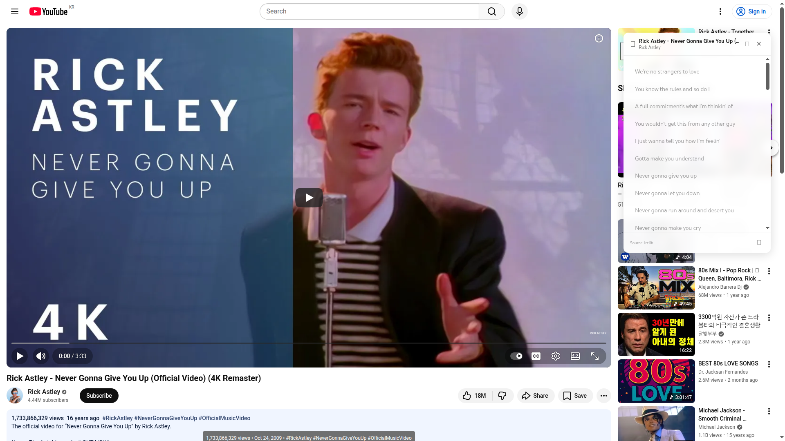
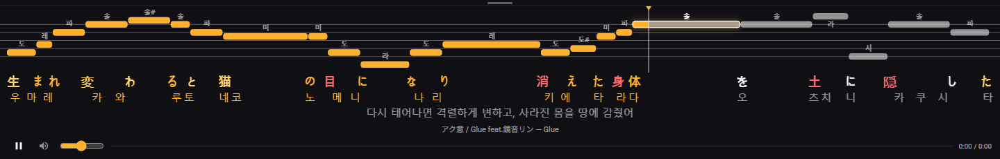

# Everyric2

유튜브 영상에 **타임싱크 가사·번역·발음·가라오케 음정 바**를 얹어 주는 로컬 서버 + Chrome 확장.

가사 텍스트만 있으면 CTC 강제 정렬(GPU 가속)로 줄·글자 단위 타이밍을 만들고, LLM으로 자연스러운 가사체 번역과 한글 독음을 붙이고, 보컬 멜로디(f0)를 전사해 노래방 스타일 음정 바까지 그려 줍니다.



*가라오케 모드(PiP) — 멜로디 노트·계이름·한글 독음·가사체 번역:*



```
┌────────────────┐   가사 검색/생성/번역     ┌───────────────────────────┐
│ Chrome 확장     │ ◄───────────────────► │ Everyric2 서버 (FastAPI)   │
│ (유튜브 오버레이) │                       │ CTC 정렬 · demucs · RMVPE  │
└────────────────┘                       │ LLM 번역/독음 · yt-dlp     │
                                         └───────────────────────────┘
```

**[한국어](#한국어-사용-안내)** | **[English](#english-guide)** | **[日本語](#日本語ガイド)**

## 한국어 사용 안내

### ① 확장 설치

1. [Releases](https://github.com/onpe5679/Everyric2/releases)에서 최신 `Everyric-Chrome-<버전>.zip`을 받아 압축을 풉니다.
2. 주소창에 `chrome://extensions`를 입력하고 우측 상단 **개발자 모드**를 켭니다.
3. **압축해제된 확장 프로그램을 로드합니다**를 눌러 방금 압축 해제한 폴더를 선택합니다.

### ② 첫 사용

유튜브에서 곡 영상을 열면 가사 패널이 자동으로 뜹니다. 서버에 이미 등록된 곡은 즉시 표시되고, 처음 보는 곡이면 패널의 **✨ 싱크 생성** 버튼으로 만들 수 있습니다.
번역을 보려면 패널 설정(⚙)에서 **가사 번역 표시**를 켜고 언어(한국어·English·日本語)를 고르세요 — 이후엔 제목바의 언어 칩을 눌러 언제든 바로 전환할 수 있습니다.

### ③ 기능 요약

- **3개 언어 번역**: 한국어·영어·일본어를 서로 번역 — 곡의 원어와 같은 언어는 자동으로 생략됩니다
- **발음 표기**: 원문에 맞춰 한글(hangul)·로마자(romaji)·가나(kana) 표기를 자동으로 골라 보여줍니다
- **가라오케 음정 바 (PiP)**: 항상 위에 뜨는 별도 창에 멜로디 노트·계이름·발음·번역이 타이밍에 맞춰 정렬됩니다
- **언어 칩**: 제목바에서 이 곡에 어떤 언어가 준비돼 있는지 한눈에 보고 클릭 한 번으로 전환합니다

### ④ 서버

기본 서버 주소는 `https://everyric.moref.co`이며 **API 키를 입력할 필요가 없습니다** — 설정의 키 칸은 비워 두세요. 가사 조회는 무제한이고, 새 싱크 생성만 이용자당 하루 15건으로 제한됩니다.
직접 서버를 구동하고 싶다면 아래 [자체 호스팅](#자체-호스팅-개발자용) 절을 참고하세요.
개인정보처리방침: <https://everyric.moref.co/privacy>

---

## English Guide

### ① Install the extension

1. Download the latest `Everyric-Chrome-<version>.zip` from [Releases](https://github.com/onpe5679/Everyric2/releases) and unzip it.
2. Open `chrome://extensions` and turn on **Developer mode** (top right).
3. Click **Load unpacked** and select the folder you just unzipped.

### ② First use

Open a song's video on YouTube and the lyrics panel opens automatically. Songs the server already knows show up instantly; for a new one, use the **✨ Generate sync** button in the panel.
To see translations, open the panel's settings (⚙), turn on **Show translation**, and pick a language (한국어 · English · 日本語) — after that, switch languages anytime with the chips in the title bar.

### ③ Features

- **Three-language translation** — Korean, English, and Japanese, translated into each other; a song already in your language skips translation automatically
- **Pronunciation** — shown in Hangul, romaji, or kana, chosen automatically to match the original text
- **Karaoke pitch lane (PiP)** — a separate always-on-top window with melody notes, solfège labels, pronunciation, and translation lined up to the beat
- **Language chips** — the title bar shows which languages are ready for this song; one click switches between them

### ④ Server

The default server is `https://everyric.moref.co` and **no API key is required** — leave the key field empty. Lookups are unlimited; generating a new sync is capped at 15 per user per day.
Want to run your own server instead? See [Self-Hosting](#self-hosting-for-developers) below.
Privacy policy: <https://everyric.moref.co/privacy>

---

## 日本語ガイド

### ① 拡張機能のインストール

1. [Releases](https://github.com/onpe5679/Everyric2/releases)から最新の`Everyric-Chrome-<バージョン>.zip`をダウンロードして解凍します。
2. `chrome://extensions`を開き、右上の**デベロッパーモード**をオンにします。
3. **パッケージ化されていない拡張機能を読み込む**をクリックし、解凍したフォルダを選択します。

### ② はじめての使い方

YouTubeで曲の動画を開くと、歌詞パネルが自動で表示されます。サーバーに既に登録されている曲はすぐに表示され、初めての曲はパネルの**✨ 同期を生成**ボタンで作成できます。
翻訳を表示するには、パネルの設定(⚙)で**歌詞の翻訳を表示**をオンにし、言語(한국어・English・日本語)を選んでください — その後はタイトルバーの言語チップでいつでも切り替えられます。

### ③ 主な機能

- **3言語翻訳** — 韓国語・英語・日本語を相互に翻訳。曲の原語と同じ言語は自動的にスキップされます
- **発音表記** — 原文に合わせてハングル・ローマ字・かなの表記を自動的に選んで表示します
- **カラオケ音程バー(PiP)** — 常に最前面に表示される別ウィンドウに、メロディノート・階名・発音・翻訳がタイミングに合わせて並びます
- **言語チップ** — この曲がどの言語で準備できているかタイトルバーで一目で分かり、クリック一つで切り替えられます

### ④ サーバー

デフォルトのサーバーは`https://everyric.moref.co`で、**APIキーの入力は不要です** — 設定のキー欄は空のままにしてください。歌詞の検索は無制限、新規同期の生成のみ1ユーザーあたり1日15件までです。
自分でサーバーを立てたい場合は、下記の[セルフホスティング](#セルフホスティング-開発者向け)を参照してください。
プライバシーポリシー: <https://everyric.moref.co/privacy>

---

## 주요 기능

### Chrome 확장 (`everyric2-chrome/`)
- **가사 오버레이**: 유튜브 위 드래그 가능한 패널, 현재 줄 하이라이트 + 글자 단위 카라오케 필
- **자동 가사 검색**: 서버 저장 싱크 → 보카로 가사 위키(발음·사람 번역) → LRCLIB 순
- **AI 싱크 생성**: 가사 붙여넣기 → 서버가 오디오를 받아 정렬 (진행 단계·퍼센트 칩 표시, 칩 클릭으로 언제든 취소)
- **전사 완료 브라우저 알림**: 백그라운드에서 돌던 싱크 생성이 끝나면 브라우저 알림으로 알려줌
- **번역·한글 독음**: LLM이 곡 전체 맥락으로 가사체 번역 + 원문 발음의 한글 표기
- **가라오케 음정 바 (BETA)**: PiP 창에 멜로디 노트·계이름·발음·마이크 음정 궤적, 멜로디 신디사이즈·메트로놈(배속/시작 박) 재생, 곡 키·BPM 표시, 좌상단 미니 토글로 가라오케/영상 전환
- **유튜브 자막 가져오기**: 영상 자막(예: 일본어 가사 자막)을 타이밍 그대로 싱크 가사로
- **싱크 링크**: inst·커버 영상이 원본 영상의 전사를 오프셋 + 배속(rate, nightcore 커버 등)과 함께 재사용
- **영상별 싱크 오프셋**: ±0.1s 조정이 영상마다 서버에 저장·복원

### 서버 (`everyric2/`)
- **CTC 강제 정렬**: HuggingFace MMS wav2vec2, RTX GPU에서 4분 곡 기준 수십 초
- **독음(ko) 정렬**: 한글 발음 텍스트로 정렬 후 원문에 역매핑 — 일본어 합성음(보컬로이드)에서 신뢰도 대폭 개선
- **타이밍 보정 체인**: demucs 보컬 분리 → VAD 기반 라인 클램프·늘임음 연장·간주 스냅
- **멜로디 전사**: RMVPE(폴백 FCPE) f0 → 음절 앵커 노트, 옥타브 폴딩, 키 추정(K-S) + 스케일 스냅
- **번역 엔진**: Gemini / NVIDIA NIM / OpenAI 호환(로컬 LLM) — 키가 없으면 자동 전환, 독음 가나 혼입 자동 검증·재시도

### After Effects 패널

AE 플러그인은 별도 비공개 저장소로 이전되었습니다. 이 저장소에서는 AE 소스와 ZXP를 배포하지 않습니다.

## 다운로드

빌드된 배포본은 [Releases](https://github.com/onpe5679/Everyric2/releases)에서 받을 수 있습니다:

| 구성 요소 | 파일 | 설치 |
|---|---|---|
| Chrome 확장 | `Everyric-Chrome-<버전>.zip` | 압축 해제 → `chrome://extensions` → 개발자 모드 → **압축해제된 확장 프로그램 로드** |
| 서버/엔진 | `everyric2-<버전>-py3-none-any.whl` | `pip install <경로/URL>` (소스 설치는 아래 [자체 호스팅](#자체-호스팅-개발자용) 참고) |

## 자체 호스팅 (개발자용)

기본 서버(`everyric.moref.co`) 대신 직접 서버를 구동하고 싶은 경우입니다. 그냥 확장을 쓰고
싶다면 위 [설치 안내](#한국어-사용-안내)만으로 충분합니다 — 이 절은 필요 없습니다.

### 1. 서버

요구 사항: Python 3.10+, ffmpeg, (권장) CUDA GPU

```bash
git clone https://github.com/onpe5679/Everyric2.git
cd Everyric2
pip install uv && uv sync            # 또는 pip install -e ".[all]"

# GPU (RTX 50xx는 cu128 필수)
uv pip install "torch==2.8.0+cu128" --index-url https://download.pytorch.org/whl/cu128

# 멜로디 전사용 RMVPE 가중치 (선택 — 없으면 FCPE 자동 폴백)
# hf_hub_download("lj1995/VoiceConversionWebUI", "rmvpe.pt") → models/rmvpe/rmvpe.pt

uv run uvicorn everyric2.server.main:app --port 8000   # 기본 127.0.0.1(로컬 전용)
```

번역·독음을 쓰려면 API 키 하나를 설정합니다 (없으면 무료 웹 번역 폴백 — 발음표기 불가):

```bash
# 둘 중 하나
export GEMINI_API_KEY=...
export NVIDIA_API_KEY=nvapi-...   # 또는 저장소 루트에 nvapi.txt (gitignore됨)
```

> **⚠️ 보안 경고 — 외부에 노출하기 전에 반드시 읽으세요**
>
> 서버 기본 bind는 `127.0.0.1`(로컬 전용, 인증 없음)입니다. `--host 0.0.0.0` 등으로
> LAN·공인망에 노출한다면 **`EVERYRIC_SERVER_API_KEY`를 반드시 설정하세요.** CORS
> 설정(`chrome-extension://` 오리진만 허용)은 브라우저가 보내는 요청만 막을 뿐,
> `curl`이나 스크립트로 직접 호출하는 요청은 Origin 헤더 자체가 없어 CORS와 무관하게
> 통과합니다 — 즉 CORS는 노출된 서버를 지켜주지 않습니다.
>
> 공개 배포에는 추가로 `EVERYRIC_SERVER_ADMIN_API_KEY`와
> `EVERYRIC_SERVER_DAILY_DESTRUCTIVE_LIMIT`(기본 2)를 함께 설정하는 것을 권장합니다 —
> 강제 재생성·싱크 초기화 같은 파괴적 행위를 영상당 하루 한도로 제한하고, 어드민 키
> 보유자만 무제한으로 둘 수 있습니다.

### 2. Chrome 확장을 소스에서 빌드

자체 서버를 확장에 연결하려면 소스에서 빌드하거나(아래) [Releases](https://github.com/onpe5679/Everyric2/releases)의
`Everyric-Chrome-<버전>.zip`을 그대로 씁니다:

```bash
cd everyric2-chrome
npm install && npm run build
```

`chrome://extensions` → 개발자 모드 → **압축해제된 확장 프로그램 로드** → `everyric2-chrome/dist` 선택.
설정(⚙)에서 서버 URL을 자체 서버 주소로 바꾸고, 처음 한 번은 확장의 권한 설정 페이지에서
로컬(또는 자체 도메인) 접근을 허용해야 합니다 — 기본 서버(everyric.moref.co)만 쓰는 대부분의
설치에는 필요 없는 절차입니다.

> Windows에서 서버 URL은 `http://127.0.0.1:8000`을 쓰세요 — `localhost`는 IPv6 선시도로 요청당 ~2초 지연될 수 있습니다.

## 서버 API 요약

| 메서드 | 경로 | 설명 |
|---|---|---|
| GET | `/health` | 상태·GPU 확인 |
| GET | `/api/sync/{video_id}` | 저장된 싱크 조회 (템포·키·사용자 오프셋 포함) |
| POST | `/api/sync/generate` | 싱크 생성 잡 등록 (같은 영상·가사 진행 중이면 합류) |
| POST | `/api/sync/regenerate` | 캐시 무시 재생성 (`force`) |
| DELETE | `/api/sync/{video_id}` | 이 영상 싱크 초기화 |
| POST/DELETE | `/api/sync/link` | inst·커버 → 원본 싱크 링크/해제 (`rate`: 원곡 대비 재생 배속, nightcore 커버용, 기본 1.0) |
| PUT | `/api/sync/offset/{video_id}` | 영상별 사용자 오프셋 저장 |
| GET | `/api/job/{job_id}` | 잡 진행률 (단계명 + 단계 내 %) |
| POST | `/api/job/{job_id}/cancel` | 진행/대기 중 잡 취소 (단계 경계에서 중단) |
| POST | `/api/translate` | LLM 번역 + 한글 독음 (가나 혼입 자동 검증·재시도, 입력 상한 400줄/줄당 1000자/전체 15000자 — 초과 시 422) |
| GET | `/api/captions/{video_id}` | 유튜브 자막 트랙 목록 (yt-dlp 경유) |

### 처리 파이프라인 (진행 칩 단계와 동일 순서)

```
다운로드(yt-dlp) → 캐시 확인 → 보컬 분리(demucs)
→ 전사 정렬(CTC, 보컬 스템에서) → 타이밍 보정(VAD)
→ 멜로디 분석(RMVPE f0 → 노트·키) → 저장
```

보컬 분리를 정렬보다 먼저 수행해 CTC가 반주 없는 깨끗한 보컬 스템으로 정렬합니다 (`EVERYRIC_ALIGNMENT_ALIGN_ON_VOCALS`, 기본 true — demucs 미가용 시 원본 믹스로 폴백). 분리 결과는 타이밍 보정(VAD)과 멜로디 전사에도 그대로 재사용됩니다.

## 설정 (환경 변수)

접두사별 pydantic-settings — 전체 목록은 `everyric2/config/settings.py`.

| 변수 | 기본 | 설명 |
|---|---|---|
| `EVERYRIC_ALIGNMENT_USE_PRONUNCIATION` | true | 독음(ko) 정렬 경로 (발음 커버리지 ≥90%일 때) |
| `EVERYRIC_ALIGNMENT_ALIGN_ON_VOCALS` | true | demucs 보컬 스템으로 CTC 정렬 (원 설계 복원 — false면 원본 믹스로 정렬) |
| `EVERYRIC_ALIGNMENT_STAR_GUARD_SPLICE` | true | star-swallow 가드 발동 시 전곡 폴백 대신 간주 전 ko + 간주 후 원문 정렬 스플라이스 |
| `EVERYRIC_MELODY_ENABLED` | true | 멜로디 노트 전사 |
| `EVERYRIC_MELODY_F0_MODEL` | rmvpe | f0 백엔드 (rmvpe/fcpe) |
| `EVERYRIC_MELODY_KEY_DETECT` / `KEY_SNAP` | true | 곡 키 추정 / 스케일 기반 노트 보정 |
| `EVERYRIC_TRANSLATION_ENGINE` | gemini | gemini / nvidia / openai / local (키 없으면 자동 전환) |
| `EVERYRIC_AUDIO_SOURCE_ADDRESS` | - | 다운로드 회선 바인딩 (403 스로틀 우회) |
| `EVERYRIC_SERVER_API_KEY` | - | 설정 시 모든 `/api` 요청에 `X-API-Key` 헤더 요구 (`/health` 제외). 공인망 노출 시 필수 |
| `EVERYRIC_SERVER_MAX_JOB_AUDIO_SEC` | 1800 | 싱크 생성 허용 최대 오디오 길이(초). 초과 영상은 다운로드 직후 친절히 실패 (0=무제한) |
| `EVERYRIC_SERVER_ADMIN_API_KEY` | - | 설정 시 파괴적 행위(재생성·초기화)에 일일 한도 적용, 이 키는 면제 |
| `EVERYRIC_SERVER_DAILY_DESTRUCTIVE_LIMIT` | 2 | 비어드민의 영상당 24시간 한도 |

공개 배포 시 권장 설정은 위의 [보안 경고](#자체-호스팅-개발자용) 참고.

## CLI (서버 없이 단독 사용)

파일 기반 워크플로도 그대로 지원합니다:

```bash
# 정렬 + 번역 + 발음 + 디버그 출력
everyric2 sync audio.wav lyrics.txt --engine ctc --language ja --translate --pronunciation --debug

# 프로젝트 파일(.everyric.json)로 재분할 (정렬 재실행 없이)
everyric2 reprocess output.everyric.json --segment-mode word
```

SRT(원본/번역/발음/통합) 다중 출력, Line/Word/Character 분할, 무성 간격 병합, 간주 감지, 로컬 LLM(Ollama/LM Studio) 연동 등 — 전체 옵션은 `everyric2 sync --help`.

## 한계

가사는 실제로 불리는 내용과 일치해야 합니다. 다음 경우 정렬이 어려울 수 있습니다:

- 가사에 없는 추임새·애드립이 많은 곡 (star 토큰이 일부 흡수하지만 한계 있음)
- 여러 보컬이 동시에 다른 가사를 부르는 곡
- 발음이 뭉개지는 음성 합성 — 단, 독음(ko) 정렬 경로로 보컬로이드 정확도가 크게 개선됨
- 2개 이상의 언어가 비슷한 비율로 혼재된 곡
- 지원 언어: 일본어(최고 정확도)·영어·한국어

## 개발

```bash
uv run pytest tests -q                 # 서버 테스트
uv run ruff check everyric2            # 린트
cd everyric2-chrome && npm run build   # 확장 (tsc + vite)
```

- 연구 노트·실험 기록: `docs/research/`
- 확장 PRD: `docs/PRD_CHROME_EXTENSION.md`, 고급 기능 스펙: `docs/advanced-features-spec.md`

## 크레딧·라이선스

- **코드**: [Apache License 2.0](LICENSE) — 상업적 이용 포함 자유. 다만 이 소스로 **공개 서비스를 운영하는 경우 원작자(onpe)에게 알려 주시길 요청**합니다: 이메일 `perion5679@naver.com` · 디스코드 `onpe` (라이선스 조건이 아닌 비구속 요청 — [NOTICE](NOTICE) 참고 / This is a non-binding courtesy request, not a license condition — see [NOTICE](NOTICE))
- **가사·발음·번역 출처**: [보카로 가사 위키](http://vocaro.wikidot.com/) (CC BY 4.0), [VocaloidLyrics Wiki](https://vocaloidlyrics.miraheze.org/) (CC BY-SA 4.0), [LRCLIB](https://lrclib.net/) — 확장이 조회·저장 시 출처를 함께 표기합니다
- 정렬: [MMS wav2vec2](https://huggingface.co/facebook/mms-300m) — 모델 가중치 라이선스(CC-BY-NC)는 상업 배포 시 별도 확인 필요
- 멜로디: RMVPE (추론 코드 MIT 포팅, 가중치 별도 다운로드), [torchfcpe](https://github.com/CNChTu/FCPE)
- 보컬 분리: [demucs](https://github.com/facebookresearch/demucs)
